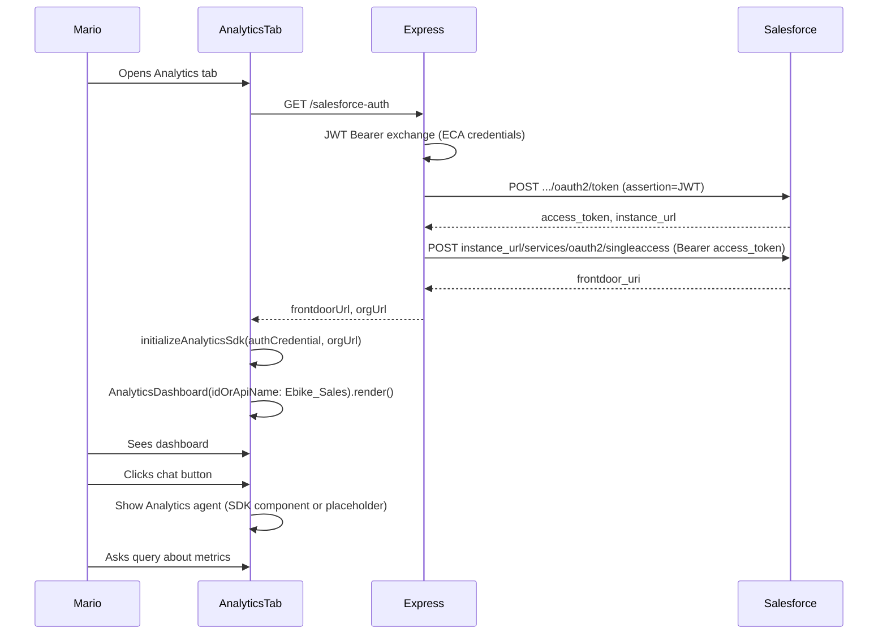

# E-Bikes Sample Application

This repository contains a sample application to show Tableau's embedded capabilities, including embedded dashboards, embedded web authoring, Pulse metrics, Pulse API and VizQL Data Service. The purpose of this sample application is not to run it, but to give you access to the source code behind [the sample application hosted in Heroku](https://ebikes-demo-a4370287451d.herokuapp.com/). 

## Authentication
The best method to create a single-sign on (SSO) experience with Tableau Embedding is to use [Connected Apps](https://help.tableau.com/current/online/en-us/connected_apps.htm). In the JWT creation (which you can see in the file server/getJwt), you pass in the username that will be used for impersonation, as well as the ClientID, the SecretID and SecretValue that is provided by the Connected App.

This sample application makes use of a JavaScript implementation, but you can find other languages (currently C#, Java, JavaScript and Python) in [this GitHub repo](https://github.com/tableau/connected-apps-jwt-samples).

If you have an application that doens't have a login, but rather is anonymous, you can make use of the [On-Demand Access](https://www.tableau.com/blog/on-demand-access-embedded-analytics) which is available with Usage Based Licensing (UBL).

## Architecture
The application has a Vite React client, using the [Tableau Embedding API React NPM package](https://www.npmjs.com/package/@tableau/embedding-api-react), and a Express server to generate the JWT (authentication token) and to act as a proxy for the VDS and Pulse API requests to Tableau Cloud.

Although this application uses React as its platform, Tableau Embedding is not limited to React. Tableau provides a Javascript SDK ([Tableau Embedding API v3](https://help.tableau.com/current/api/embedding_api/en-us/index.html)) which allows you to embed Tableau in any application that accepts HTML and JavaScript.

## Tableau Next (Analytics) for Mario

Mario’s **Analytics** tab uses the [Salesforce Analytics Embedding SDK](https://www.npmjs.com/package/@salesforce/analytics-embedding-sdk) (Tableau Next) with frontdoor authentication. The server performs the JWT bearer flow and single-access call so the client never sees credentials.

### User flow

1. Mario logs in to the application.
2. He switches to the **Analytics** tab.
3. The Tableau Next dashboard with ID **Ebike_Sales** is shown.
4. He clicks the agent chat button (bottom-right) to open the Analytics agent and ask questions about the metrics.

### Architecture

### Prerequisites

- A Salesforce org with Tableau Next enabled and a Tableau+ or Tableau Next Creator license.
- An [External Client App (ECA)](https://developer.salesforce.com/docs/analytics/sdk/guide/sdk-setup-auth.html) with JWT Bearer flow (public certificate uploaded, admin-approved users, custom Tableau Next Consumer permission set).
- A Tableau Next dashboard with API name **Ebike_Sales** in that org.
- (Optional) An Analytics and Visualization agent component in the org; its Salesforce ID is used for the chat button (see env below).

### Environment variables (server-only)

All Salesforce-related variables are **server-side only** (no `VITE_` prefix). See [.env.example](.env.example) for the full list:

- `SALESFORCE_CLIENT_ID` – ECA consumer key  
- `SALESFORCE_LOGIN_URL` – `https://login.salesforce.com` or `https://test.salesforce.com`  
- `SALESFORCE_USER` – Salesforce username (JWT subject)  
- `SALESFORCE_PRIVATE_KEY` – PEM private key for JWT signing (or `SALESFORCE_PRIVATE_KEY_PATH` to a key file)

These work both locally (e.g. in `.env`) and on Heroku (config vars). For the optional in-app agent chat, set `VITE_SALESFORCE_ANALYTICS_AGENT_ID` in the build environment to the Salesforce ID of your Analytics agent component.

### References

- [Frontdoor single access](https://help.salesforce.com/s/articleView?language=en_US&id=xcloud.frontdoor_singleaccess.htm&type=5)
- [Tableau Next Embedding SDK – Setup and auth](https://developer.salesforce.com/docs/analytics/sdk/guide/sdk-setup-auth.html)
- [Analytics Embedding SDK reference](https://developer.salesforce.com/docs/analytics/sdk/references)

---

In the client folder, you will find multiple folders, which are explained below

### Agent folder

For TC25, Tableau built a custom Agentforce agent that allows users to ask questions on the e-bikes data source. The agent uses custom Apex classes to invoke the Metadata API to transform user questions into a VizQL Data Service (VDS) query, and then uses Generative AI to convert the VDS JSON output to a human-readable text.

Because of the complexity of the current agent we have decided to just iframe the Agentforce agent, but we have plans to improve this integration in the future.

### Analytics folder

Learn how to embed dashboards and Pulse metrics into your applications using the Tableau React NPM package.

| Component | Page | Purpose |
|----|----|-----|
| Analyze.tsx | [Embedded web authoring](https://ebikes-demo-a4370287451d.herokuapp.com/Mario/analyze) | Embed a new workbook connected to an existing published data source |
| EmbeddedDashboard.tsx | n/a | Uses the TableauViz web component to embed a dashboard, it shows how you can programmatically apply a filter to a dashboard |
| EmbeddedDashboardUpsellable.tsx | [Embedded dashboard for McKenzie](https://ebikes-demo-a4370287451d.herokuapp.com/McKenzie/product-catalog) (and then click on 'Upgrade to premium') | This component does multiple things: (1) Show how to use the Pulse API to get the subscribed metrics and get their insights, (2) Show how you can use [User Attribute Functions](https://www.tableau.com/blog/unlock-power-personalized-analytics-user-attribute-functions) to personalize your dashboard and in this case provide advanced features (YoY comparisons), and (3) shows how you can add interactivity to your dashboard, which is in this case filtering the data on the selected bike |
| EmbeddedPulse.tsx | n/a | Embed a Pulse metric in one of the three supported layouts (BAN, Card, Default), and shows how to theme a Pulse metric (Dark mode or Light mode in the sample application)
| Performance.tsx | [Embedded dashboard for Mario](https://ebikes-demo-a4370287451d.herokuapp.com/Mario/performance) | The page to show the embedded dashboard for Mario |
| Pulse.tsx | [Pulse metrics](https://ebikes-demo-a4370287451d.herokuapp.com/McKenzie/analyze) | The page to show the Pulse metrics, including the use of the Pulse UI, Custom Pulse UI using the API, and the Enhanced Q&A API | 
| PulseCustom.tsx | n/a | Executes the Pulse API and creates a custom rendering with the information provided by the Pulse API |
| PulseEnhancedQA.tsx | n/a | Uses the Enhanced Q&A API to allow users to ask any question on a series of metrics. In the sample application, those metrics are the Bike Sales and Bike Returns metrics |
| PulseStandard.tsx | n/a | Uses the TableauPulse web component to embed a Pulse metric in the provided layout |
| usePulseAPI.tsx | n/a | hook to provide support for executing the Pulse API requests |
| WebAuthoring.tsx | n/a | Uses the TableauAuthoringViz web component to embed an authoring experience |

### auth folder

The login screen for the application. You can ignore this folder.

### header folder

The NotificationBell.tsx runs a VDS query to get the top 3 bikes with the most returns, and if there are any it will show a bell icon next to the profile icon in the top right.

### productCatalog folder

Learn how to use VDS in your applictions. All these components are used in the [Product Catalog page](https://ebikes-demo-a4370287451d.herokuapp.com/McKenzie/product-catalog) in the sample application.

| Component | Purpose |
|----|-----|
| Product.tsx | Represents the tile with the bike, but doesn't contain any Tableau Embedding examples. Most interesting is the $-signs in the top right corner which to represent sales data passed into the component, which is retrieved by VDS. |
| ProductCatalog.tsx | Glues all experiences together on the product catalog. When the user clicks on a bike, it will pass the selected bike to the EmbeddedDashboardUpsellable.tsx component, which will use that information to apply the filter. When the user clicked on the "Upgrade to premium" link, the bike tile will flip to show the Sparkline which is another use case of how you can use VDS. |
| productlist.ts | The bikes available to the application |
| Sparkline.tsx | Uses the recharts NPM package to create a custom sparkline using the data that is returned from the VDS request. This sparkline is only available in the Premium license and is presented when you hover the mouse over a bike |
| useProductSales.ts | The hook that creates the body for a VDS request and sends the request to the server |

## References

- [Configure Connected Apps with Direct Trust](https://help.tableau.com/current/online/en-us/connected_apps_direct.htm)
- [Tableau Embedding API v3](https://help.tableau.com/current/api/embedding_api/en-us/index.html)
- [Tableau Embedding Playground Overview](https://developer.salesforce.com/tableau/embedding-playground/overview)
